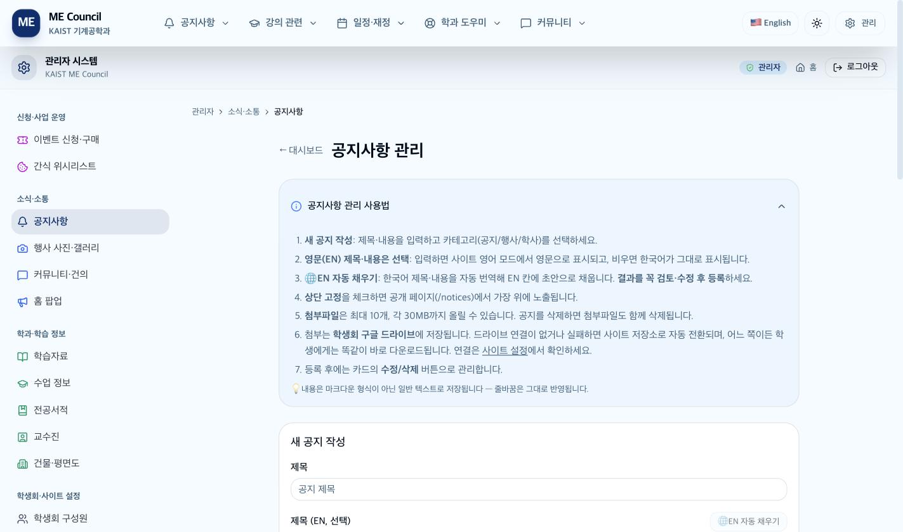
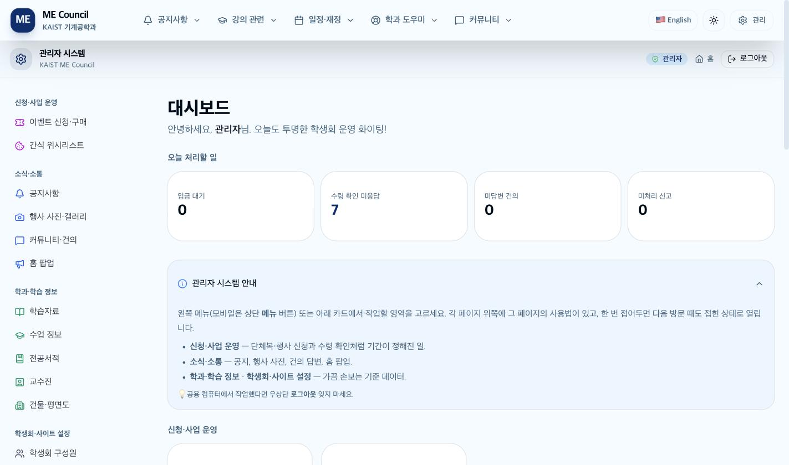
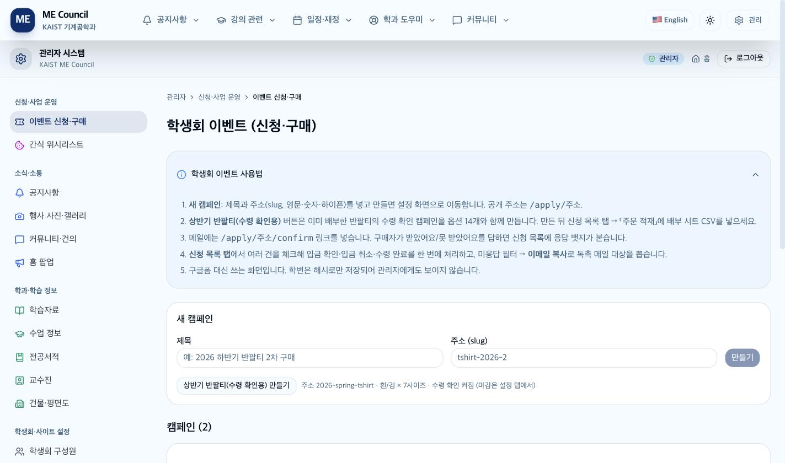
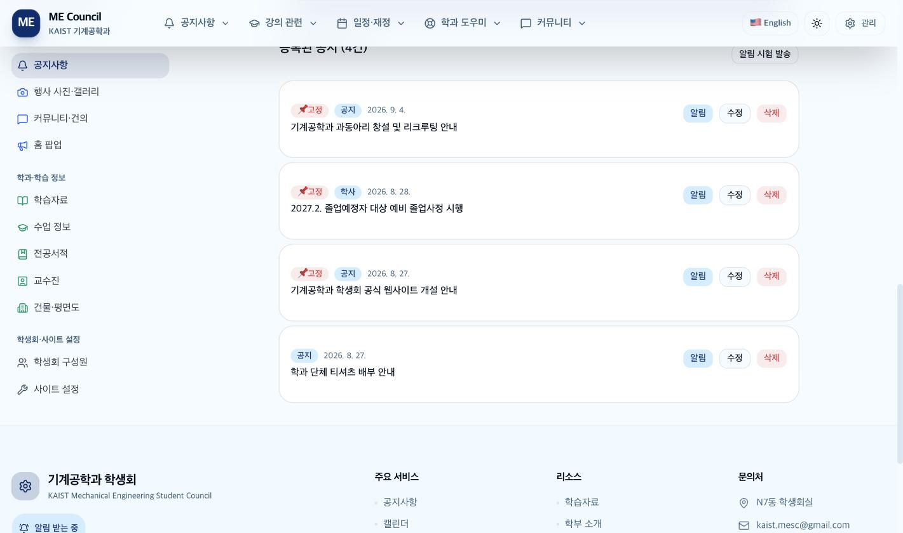

# 기계공학과 학생회 사이트 운영 매뉴얼 (관리자용)

**https://mesc-website.vercel.app/admin**

이 문서는 학생회 임원이 사이트를 운영하는 데 필요한 모든 것을 담았습니다. 인수인계 때 이 문서 하나만 넘겨도 되도록 썼습니다.

> ⚠️ **공용 컴퓨터에서 작업했다면 오른쪽 위 "로그아웃"을 반드시 누르세요.**

---

## 목차

| 장 | 내용 |
|---|---|
| [0장](#0장-시작하기) | 로그인, 화면 구조, 사용법 카드 |
| [1장](#1장-대시보드) | 오늘 처리할 일 |
| [2장](#2장-이벤트-신청구매-캠페인) | **캠페인 운영 — 가장 자주 쓰는 화면** |
| [3장](#3장-공지사항) | 공지 작성, 첨부파일, 알림 발송 |
| [4장](#4장-행사-사진갤러리) | 행사 갤러리와 구글 드라이브 |
| [5장](#5장-커뮤니티건의) | 건의 답변, 신고 처리 |
| [6장](#6장-홈-팝업) | 홈 화면 팝업 |
| [7장](#7장-학과학습-정보) | 학습자료, 수업 정보, 전공서적, 교수진, 평면도 |
| [8장](#8장-학생회사이트-설정) | 구성원, 사이트 설정 |
| [9장](#9장-되돌릴-수-없는-작업-) | **⚠️ 반드시 읽어야 할 위험 목록** |
| [10장](#10장-개인정보-취급) | 개인정보 취급 원칙 |
| [11장](#11장-문제-해결) | 곤란할 때 |
| [12장](#12장-인수인계-체크리스트) | 인수인계 |

부록: [규칙과 한도](부록A-규칙과-한도.md) · [오류 문구 사전](부록B-오류-문구-사전.md)

---

## 0장. 시작하기

### 0-1. 로그인

`/admin` 으로 들어가면 로그인 화면이 나옵니다. 계정은 두 종류입니다.

- **회장 계정** — 서버 환경변수에 설정된 계정
- **추가 계정** — 교직원 등에게 발급한 계정 (예: `mestaff`)

세션은 **7일**간 유지됩니다. 그 뒤에는 다시 로그인해야 합니다.

#### 로그인이 안 될 때

| 상황 | 설명 |
|---|---|
| "아이디 또는 비밀번호가 올바르지 않습니다." | 자격이 틀렸거나 **잠긴 상태**입니다. 이 둘은 같은 문구로 나옵니다 |
| 비밀번호가 맞는데 계속 실패 | **10분 안에 계정 10회 또는 같은 인터넷 회선에서 20회 실패하면 잠깁니다.** 10분 기다렸다가 다시 하세요 |

> 문구를 구분하지 않는 것은 의도된 설계입니다. 계정이 있는지 없는지를 외부에 알려 주지 않기 위해서입니다.

### 0-2. 화면 구조

로그인하면 왼쪽(휴대폰은 위쪽 "메뉴" 버튼)에 네 묶음이 나옵니다.

| 묶음 | 언제 쓰나 | 안에 있는 것 |
|---|---|---|
| **신청·사업 운영** | 기간이 정해진 일 | 이벤트 신청·구매 / 간식 위시리스트 |
| **소식·소통** | 자주 | 공지사항 / 행사 사진·갤러리 / 커뮤니티·건의 / 홈 팝업 |
| **학과·학습 정보** | 가끔 | 학습자료 / 수업 정보 / 전공서적 / 교수진 / 건물·평면도 |
| **학생회·사이트 설정** | 학기 초 | 학생회 구성원 / 사이트 설정 |

위쪽에 "관리자 > 묶음 > 화면" 순서로 현재 위치가 표시됩니다.

### 0-3. 사용법 카드



화면마다 위쪽에 그 화면의 사용법이 접혀 있습니다. 한 번 접어 두면 다음에도 접힌 채로 열립니다.

> 접힘 상태는 **그 브라우저에만** 저장됩니다. 다른 사람이나 다른 기기에서는 다시 펼쳐진 채로 나옵니다.

---

## 1장. 대시보드



맨 위 **"오늘 처리할 일"** 네 카드가 지금 손봐야 할 일을 숫자로 보여 줍니다.

| 카드 | 정확한 뜻 | 누르면 |
|---|---|---|
| **입금 대기** | 모든 캠페인을 통틀어 상태가 "대기"인 신청 수 | 이벤트 신청·구매 |
| **수령 확인 미응답** | 수령 확인을 켠 캠페인에서, 취소되지 않았는데 아직 답이 없는 건 | 이벤트 신청·구매 |
| **미답변 건의** | 답변이 없고 숨김도 아닌 건의 | 커뮤니티·건의 |
| **미처리 신고** | 신고가 1건 이상인 게시글 + 건의 (합산) | 커뮤니티·건의 |

> 숫자 대신 **`-`** 가 보이면 **0건이 아니라 집계를 못 불러온 것**입니다. 새로고침하세요. "집계를 불러오지 못했습니다" 안내도 함께 뜹니다.

아래쪽에 홈페이지·공지사항·학생회 이벤트·과비 확인으로 가는 빠른 링크가 있습니다.

---

## 2장. 이벤트 신청·구매 (캠페인)



구글폼을 대신하는 화면입니다. 신청받고, 입금 확인하고, 배부하고, 수령 확인까지 전부 여기서 합니다.

### 2-1. 전체 흐름 한눈에

```
① 캠페인 만들기 → ② 설정(옵션·가격·재고·기간·계좌) → ③ 미리보기로 확인
→ ④ 공개 → ⑤ 신청 접수 → ⑥ 입금 확인 → ⑦ 배부(수령 완료)
→ ⑧ (필요하면) 수령 확인 받기 → ⑨ 정산·CSV
```

### 2-2. 캠페인 만들기

목록 화면에서 두 가지 방법이 있습니다.

| 버튼 | 무엇을 만드나 |
|---|---|
| **만들기** | 제목과 주소만 넣은 빈 캠페인. 옵션은 설정에서 직접 넣습니다 |
| **상반기 반팔티(수령 확인용) 만들기** | 흰/검 × 7사이즈 = 14옵션, 수령 확인이 켜진 캠페인을 한 번에 만듭니다 |

**주소(slug)** 는 영문 소문자·숫자·하이픈만 씁니다. 공개 주소는 `/apply/주소` 가 됩니다.

> ⚠️ **주소는 한 번 정하면 바꾸지 마세요.** 메일이나 인스타에 이미 뿌린 링크가 전부 깨집니다.

### 2-3. 설정 탭 — 무엇을 정하나

#### 기본 정보

| 항목 | 설명 |
|---|---|
| 제목 / 제목(EN) | 1~200자. EN을 비우면 영어 모드에서도 한국어가 나옵니다 |
| 주소(slug) | 위 참고. 중복이면 저장이 거부됩니다 |
| **종류** | **굿즈** = 색상·사이즈 칩이 있는 상품형 화면 / **일반 신청** = 목록형 화면 |
| 공개 | 꺼 두면 학생에게 안 보입니다. **관리자는 미리보기 가능** |
| 수량 선택 허용 | 끄면 1개씩만 |
| 학번 필수 | 끄면 학번 없이 신청 가능. 대신 조회는 이메일로만 됩니다 |
| **이미지** | 최대 8장. 첫 장이 대표. **시안과 사이즈표를 함께 올리세요.** 화살표로 순서를 바꿉니다 |
| 시작 / 마감 | 비우면 즉시·무기한 |
| 1인 최대 수량 | **그 사람의 모든 주문을 합산해서** 막습니다 |
| 표시 순서 | 작을수록 위 |
| 입금 계좌 | 신청 완료 화면에만 보입니다 |
| 완료 안내 / (EN) | 신청 완료 화면에 붙는 안내 |

#### 수령 확인

**"수령 확인 받기"** 를 켜면 `/apply/주소/confirm` 이 열립니다. 확인 마감과 안내 문구를 함께 정합니다.

#### 구분별 가산 금액

대학원생·교수님·졸업생·기타에 얹을 금액입니다. 학부생이 기준값이고, 0이나 빈칸이면 가산이 없습니다.

#### 옵션

**굿즈라면 그룹 = 색상, 이름 = 사이즈**로 넣으세요. 그래야 상품형 화면이 제대로 나옵니다.

- **재고를 비우면 무제한**입니다.
- **옵션 일괄 추가** — 한 줄에 `그룹,이름,가격,재고` 형식으로 붙여넣습니다.
- **반팔티 14옵션 채우기** — 흰/검 × 7사이즈를 한 번에 (2XL 이상 9,500원, 나머지 8,000원)
- **이미 주문에 쓰인 옵션은 지워도 실제로는 지워지지 않고 "사용 안 함"으로만 바뀝니다.** 기존 주문을 보호하기 위해서입니다.

> **설정을 바꿔도 기존 주문의 금액은 바뀌지 않습니다.** 신청 시점의 금액이 그대로 남습니다. 금액을 다시 계산하려면 그 주문의 "항목 수정"을 열어 저장해야 합니다.

### 2-4. 공개 전 미리보기 (꼭 하세요)

공개를 끈 상태에서도 **관리자로 로그인한 채** 공개 주소를 열면 학생이 볼 화면을 그대로 볼 수 있습니다. 위에 "비공개 미리보기" 배너가 뜨고 신청 버튼은 눌리지 않습니다.

상세 화면의 링크 문구로 지금 상태를 알 수 있습니다.

- "공개 페이지 보기" → 학생에게 보이는 중
- "미리보기 (비공개 — 관리자만 보임)" → 아직 안 보임

### 2-5. 신청 목록 탭 — 매일 쓰는 화면

#### 맨 위 정산 카드

입금 확인 금액 / 입금 대기 금액 / 환불 대기(건수·금액) / 수령 완료 수량 / 취소 건수

**이 숫자는 필터와 무관하게 항상 전체 기준**입니다.

#### 찾기

- **필터**: 전체 / 대기 / 입금 / 수령 / 취소
- **검색**: 이름·이메일·주문번호·구분에서 부분 일치
- **정렬**: 최신순 / 오래된순 / 이름순 / 상태순 / 금액순

> 필터·검색·정렬을 바꾸면 **체크박스 선택이 초기화됩니다.** 먼저 걸러 놓고 선택하세요.

#### 한 번에 여러 건 처리하기

체크박스로 여러 건을 고르면 아래에 처리 바가 뜹니다.

| 버튼 | 하는 일 |
|---|---|
| 입금 확인 | 대기 → 입금 확인 |
| 입금 취소 | 입금 확인 → 대기 (잘못 눌렀을 때) |
| 수령 완료 | 입금 확인 → 수령 완료. **배부 담당자 이름을 묻습니다** |
| 선택 이메일 복사 | 고른 건들의 이메일만 복사 |
| 신청 취소 | 취소 상태로 |

모두 "네/아니오" 확인을 거칩니다. **취소한 것도 "복구"로 되돌릴 수 있습니다.**

#### 한 건씩 처리하기

카드마다 상태 버튼과 함께 다음이 있습니다.

- **환불 완료** — 환불이 필요한 건을 처리한 뒤 눌러 두면 정산 카드에서 빠집니다
- **메모** — 관리자만 보는 메모
- **입금자명** — 통장 이름이 다를 때 고쳐 둡니다
- **항목 수정** — 사이즈를 잘못 신청한 경우 등. 금액이 서버에서 다시 계산됩니다. **재고는 검사하지 않으니** 관리자가 판단해서 고치세요

#### 옵션별 합계 = 발주표

"옵션별 합계 (취소 제외)" 카드가 그대로 발주표입니다. 업체에 이 숫자를 넘기면 됩니다.

#### 이메일 복사

**"이메일 복사 (현재 필터 N건)"** 은 지금 필터·검색이 적용된 목록의 이메일을 중복 없이 복사합니다. Gmail 받는 사람 칸에 붙여넣으면 됩니다.

> 미응답만 걸러 독촉 메일을 보낼 때 이 기능을 쓰세요.

#### CSV 내보내기

**"전체 CSV 내보내기"** 는 **필터와 무관하게 전체**를 내보냅니다. 주문번호·상태·이름·이메일·전화·항목·금액·수령 확인·배부자·환불 여부까지 들어갑니다.

**학번은 CSV에 들어가지 않습니다.** 해시로만 저장돼 있어서 원문이 없습니다.

> 엑셀에서 열었을 때 수식으로 실행되지 않도록 자동 처리됩니다.

### 2-6. 수령 확인 탭

수령 확인을 켠 캠페인에서만 나타납니다.

- **필터**: 미응답(기본) / 받음 / 못 받음 / 전체
- **"못 받음 집계"** 카드 — 색·사이즈·희망 처리별로 몇 벌이 부족한지 바로 나옵니다
- **이메일 복사** — 미응답만 걸러 독촉

**전화나 카톡으로 받은 답은 "받음으로 / 못 받음으로" 버튼으로 대신 기록**할 수 있습니다.

처리를 끝낸 건은 **"처리 완료"** 로 표시해 두면 집계에서 빠집니다.

> ⚠️ 이 탭의 버튼들은 **확인 창 없이 즉시 실행**됩니다. 특히 "응답 초기화"는 학생이 고른 처리 방법까지 함께 지웁니다.

### 2-7. 데이터 가져오기 탭

이미 끝난 구매(구글폼·엑셀 명단)를 주문으로 넣는 기능입니다.

1. 시트를 **CSV**로 내려받습니다.
2. 모드를 고릅니다.
   - **배부 시트** — `구분,이름,학번,전화번호,이메일,흰색,검정,배부자,픽업 유무` 형식
   - **일반 CSV** — `구분,이름,학번,전화,이메일,항목,상태` 형식
3. **미리보기**를 눌러 몇 건이 해석되는지, 문제 행이 없는지 봅니다.
4. 문제가 0건일 때만 **적재** 버튼이 켜집니다.

> ⚠️ **"이전에 적재한 주문을 지우고 새로 넣기"는 기본으로 꺼져 있습니다.**
> 켜면 이전에 적재한 주문이 지워집니다. 미리보기가 **몇 건이 지워지는지, 그중 수령 확인 응답이 몇 건인지** 알려 주니 꼭 읽고 실행하세요.
> **학생이 직접 신청한 주문은 절대 지워지지 않습니다.**
>
> 체크를 끄고 적재하면 **기존 것에 더해집니다.** 같은 CSV를 두 번 넣으면 두 배로 쌓이니 주의하세요.

**적재가 끝나면 원본 CSV 파일은 지우세요.** 학번 원문이 들어 있습니다.

### 2-8. 캠페인 삭제

설정 탭 맨 아래에 있습니다. **신청이 1건이라도 있으면 삭제되지 않습니다.**

> 신청이 있는 캠페인은 지우지 말고 **설정에서 "공개"를 끄세요.** 학생에게 안 보이면서 기록은 남습니다.

### 2-9. 간식 위시리스트

학생이 올린 간식 요청 목록입니다. **읽기와 삭제만** 됩니다. 구매·반영한 항목은 개별 삭제로 지우고, 학기 단위 정리는 "전체 삭제"를 쓰세요. 되돌릴 수 없습니다.

---

## 3장. 공지사항

### 3-1. 공지 쓰기

1. 제목과 내용을 넣고 카테고리(공지 / 행사 / 학사)를 고릅니다.
2. **🌐 EN 자동 채우기** 를 누르면 영문 칸에 번역 초안이 들어갑니다.
   > ⚠️ **자동 번역은 초안입니다. 반드시 읽어 보고 고친 뒤 등록하세요.** 이 버튼만으로는 저장되지 않고, 등록·저장을 눌러야 반영됩니다.
3. **상단 고정** 을 켜면 공개 페이지 맨 위에 붙습니다.
4. **알림 보내기** 를 켜면 등록과 동시에 구독자 전원에게 알림이 갑니다. (새 공지 등록 때만 쓸 수 있습니다)

글자 수는 제목 1~200자, 내용 1~10000자입니다. 마크다운이 아니라 일반 텍스트로 저장되며, 줄바꿈은 그대로 반영됩니다.

### 3-2. 첨부파일

| 항목 | 값 |
|---|---|
| 개수 | 최대 10개 |
| 크기 | 각 30MB |
| 형식 | PDF, 한글, 오피스, 이미지, ZIP 등 17종 |
| 저장 위치 | **학생회 구글 드라이브의 「공지 첨부」 폴더** |

- 학생은 드라이브를 거치지 않고 **우리 사이트에서 바로 내려받습니다.** 드라이브 파일을 공개로 바꿀 필요가 없습니다.
- 올리는 동안 진행률이 퍼센트로 보입니다. 큰 파일은 시간이 걸립니다.
- 공지를 지우면 드라이브 파일도 함께 지워집니다.
- **확장자만 바꾼 파일은 자동으로 거부됩니다.**
- 드라이브 연결이 끊겨 있으면 사이트 저장소로 대신 저장되고, 이때는 **4MB 이하만** 됩니다. 화면에 저장 위치가 표시되니 확인하세요.

> 업로드 중에 다른 공지를 수정하려고 폼을 바꾸면 업로드가 취소됩니다. 파일이 다 올라간 뒤에 옮기세요.

### 3-3. 알림 보내기



알림을 보내는 방법이 셋입니다.

| 방법 | 대상 | 되돌릴 수 있나 |
|---|---|---|
| 공지 작성 시 **"알림 보내기"** 체크 | **구독자 전원** | ❌ |
| 목록의 **"알림"** 버튼 | **구독자 전원** | ❌ |
| **"알림 시험 발송 (내 기기)"** | **누른 기기 하나만** | 영향 없음 |

> ⚠️ **알림은 확인 창 없이 즉시 나가고, 한 번 나가면 회수할 수 없습니다.**
> 문구를 다 확인한 뒤에 누르세요.
>
> **정말 필요한 공지에만 켜세요.** 사소한 공지까지 알림을 보내면 학생들이 알림을 꺼 버립니다.

#### 발송 결과 읽기

| 결과 문구 | 뜻 |
|---|---|
| 알림을 n명에게 보냈습니다 | 정상 |
| n명에게 보냈고 m건 실패, 만료된 구독 p건 정리 | 일부 기기가 만료됨. **조치 불필요** |
| 알림을 받도록 설정한 사람이 아직 없습니다 | 아무도 알림을 켜지 않음. 공지로 안내하세요 |
| 이 기기의 알림 구독을 찾지 못했습니다 | 시험 발송인데 이 기기가 알림을 안 켬 |
| 알림 발송 설정이 되어 있지 않습니다 | 서버 설정 문제. 개발자 문의 |

> **저장과 알림은 별개입니다.** 알림이 실패해도 공지는 저장돼 있습니다. **다시 등록하지 말고** 목록의 "알림" 버튼으로 재발송하세요.

### 3-4. 저장이 실패했을 때

| 문구 | 무엇을 해야 하나 |
|---|---|
| 로그인이 풀렸습니다 | **입력 내용과 첨부는 그대로 남아 있습니다.** 다른 탭에서 로그인한 뒤 돌아와 저장 |
| 저장은 완료됐지만 목록 갱신에 실패 | **공지는 저장됐습니다. 새로고침만 하세요.** 다시 등록하면 중복됩니다 |
| 응답을 받지 못했습니다 | 아래 목록을 확인하세요. 있으면 저장된 것입니다 |

---

## 4장. 행사 사진·갤러리

### 4-1. 행사 만들고 사진 올리기

1. **행사명과 날짜**만 넣고 "행사 추가"를 누릅니다. 대표 사진은 나중에 정해도 됩니다.
2. 드라이브가 연결돼 있으면 그 순간 **`YYYY-MM-DD-행사명` 폴더가 드라이브에 자동으로 생깁니다.**
3. 행사 카드의 **"사진"** 을 눌러 드래그하거나 업로드합니다. 사진은 드라이브의 그 폴더로 올라갑니다.
4. 첫 사진이 **자동으로 대표 사진**이 됩니다.

사진은 한 장에 25MB까지입니다.

### 4-2. 드라이브 연결

**"Drive 자동 연동"** 카드에서 연결·해제·부모 폴더 설정을 합니다.

- **연결 해제해도 이미 올라간 사진은 그대로 남습니다.**
- 부모 폴더는 드라이브 폴더 URL을 붙여넣으면 됩니다.
- **"가져오기"** 는 드라이브에 이미 있는 폴더들을 한꺼번에 행사로 만듭니다. 폴더 이름이 `YYYY-MM-DD-행사명` 형식이어야 합니다.

### 4-3. 재동기화

**"Drive 재동기화"** 는 누군가 드라이브에서 직접 사진을 넣었을 때 씁니다.

> ⚠️ **재동기화는 추가만 반영합니다.** 드라이브에서 사진을 지워도 사이트에서는 사라지지 않습니다. 사이트에서 지우려면 사진 위의 X를 직접 눌러야 합니다. (화면 안내에는 "추가/삭제"라고 적혀 있지만 실제로는 추가만 됩니다)

### 4-4. 알아둘 것

- **행사를 삭제하면 사진과 피드백도 전부 사라집니다.** 확인 창에는 이 내용이 나오지 않으니 주의하세요.
- 사이트에서 사진을 지워도 **드라이브의 원본 파일은 남습니다.**
- **"ZIP 다운로드"** 로 한 행사의 사진을 통째로 받을 수 있습니다.
- 학생이 남긴 별점·후기는 "피드백" 버튼에서 보고 지울 수 있습니다.

---

## 5장. 커뮤니티·건의

탭이 둘입니다. **건의**와 **게시글**.

### 5-1. 건의 답변

**"+ 답변 작성"** → 내용 입력 → **"저장"**. 답변은 1~2000자입니다. 답변을 달면 공개 페이지에서 학생이 볼 수 있습니다.

> **빈 내용으로 저장하면 답변이 지워집니다.** 답변을 없애려는 게 아니라면 조심하세요.

### 5-2. 신고 처리

- 목록은 **신고가 많은 순**으로 정렬됩니다.
- **신고가 5건 쌓이면 자동으로 숨겨집니다.**
- 눈 아이콘으로 숨김/보이기를 토글할 수 있습니다. (되돌릴 수 있습니다)
- 휴지통은 **영구 삭제**입니다. 게시글을 지우면 **댓글도 함께 사라집니다.**

> ⚠️ **신고 횟수를 초기화하는 기능이 없습니다.** "보이기"로 되돌려도 신고 수는 남아 있어서, 몇 건 더 신고되면 다시 자동으로 숨겨집니다. 반복되면 개발자에게 문의하세요.
>
> 신고 사유는 이 화면에서 볼 수 없습니다.

**"숨김 포함"** 체크박스로 숨겨진 것도 함께 볼 수 있습니다. 각 목록은 최대 200건까지 나옵니다.

---

## 6장. 홈 팝업

홈에 들어온 방문자에게 뜨는 안내 창입니다. 행사 신청 폼, 설문 링크 같은 시즌 안내에 씁니다.

1. **"팝업 활성화"** 를 체크하고 제목·메시지를 넣습니다.
2. **"설정 저장"** 을 누릅니다.
3. 아래에서 **링크를 추가**합니다. 라벨(한/영), URL, 이모지를 넣습니다.
4. 각 링크는 ↑↓ 로 순서를 바꾸고, 체크박스로 잠시 끌 수 있습니다.

> ⚠️ **"설정 저장"은 확인 창 없이 즉시 모든 방문자에게 반영됩니다.** 문구를 확인하고 누르세요.
>
> 행사가 끝나면 **활성화를 끄세요.**
>
> 제목을 비우면 "기계공학과 학생회"로 자동 대체됩니다.
>
> 학생이 "오늘 그만 보기"를 누르면 **24시간 동안 안 보입니다.** 그사이 내용을 바꿔도 그 학생에게는 안 뜹니다.

---

## 7장. 학과·학습 정보

학기 초에 손보고 그 뒤로는 거의 건드리지 않는 화면들입니다.

### 7-1. 학습자료

제목, 파일 URL, 카테고리(200/300/400/기타)를 넣습니다. 과목과 연결하면 그 과목 페이지에도 나옵니다.

- 파일을 드래그하면 **구글 드라이브**의 `학습자료/{과목코드}` 폴더로 올라가고 `[과목코드] 원본명` 으로 이름이 바뀝니다. **100MB까지** 됩니다.
- 드라이브 링크를 직접 붙여넣어도 됩니다. 이때 드라이브에서 **"링크가 있는 모든 사용자가 보기"** 로 공유해야 학생이 열 수 있습니다.
- **삭제해도 드라이브 원본은 남습니다.** 목록에서만 사라집니다.

### 7-2. 수업 정보

과목코드, 레벨, 과목명, 전공서, 강의 소개 영상 URL 등을 넣습니다.

> ⚠️ **과목을 삭제하면 그 과목의 강의평이 전부 영구 삭제됩니다.** 확인 창에는 이 경고가 나오지 않습니다. 학생들이 쌓아 둔 강의평이 함께 사라지니 정말 지울 것인지 확인하세요.
>
> 여기 적는 "전공서"는 자유 텍스트입니다. 전공서적 화면의 목록과 자동으로 연결되지 않습니다.

### 7-3. 전공서적

제목, 저자, 출판사, ISBN, 보유 권수, 분류를 넣습니다.

- **"표지 검색"** 을 누르면 인터넷에서 표지를 찾아 줍니다. 결과를 클릭하면 표지 주소가 채워집니다.
- 표지를 직접 올릴 수도 있습니다(4MB 이하).
- 보유 권수는 1~999 범위로 자동 보정됩니다.
- **삭제해도 올린 표지 파일은 저장소에 남습니다.**

### 7-4. 교수진

이름, 영문명, 직위, 호실, 건물, 층, 이메일, 연구 분야, 사진을 넣습니다.

- **건물을 먼저 고르면 그 건물의 층 목록이 채워집니다.** 건물·층이 없으면 "건물·평면도"에서 먼저 등록하세요.
- 위쪽 검색창으로 이름을 빠르게 찾을 수 있습니다.
- **전화번호는 관리자만 봅니다.** 공개 화면에 절대 나가지 않습니다.

### 7-5. 건물·평면도

건물(코드·이름) → 층(층 번호·평면도) → 방 순서로 등록합니다.

#### 평면도 올리기

| 방법 | 설명 |
|---|---|
| 단일 업로드 | 그 층의 평면도 하나 |
| **여러 평면도 한 번에** | 파일 이름에 "3층" 처럼 층 번호가 들어 있으면 자동으로 짝지어 줍니다. PDF·PNG·JPG·WebP, 각 30MB |

> ⚠️ **평면도 업로드는 확인 창 없이 기존 평면도를 덮어씁니다.** 잘못 올리면 되돌릴 수 없으니 파일을 확인하고 올리세요.

#### 핀 배치와 지도 편집

- **"핀 배치"** — 평면도 위에 교수님 위치를 찍습니다. "위치 제거"로 되돌릴 수 있습니다.
- **"지도 편집"** — 새 탭에서 방 영역과 이동 경로를 그립니다. 그리기만으로는 반영되지 않고 **"저장"** 을 눌러야 합니다.

> ⚠️ 지도 편집의 "저장"은 화면에 있는 내용으로 **통째로 바꿉니다.** 방을 다 지우고 저장하면 기존 방 정보가 사라집니다.

#### 삭제할 때

- **건물을 지우면 그 건물의 모든 층·평면도·방이 함께 지워집니다.**
- **층을 지우면 그 층의 모든 방이 지워지고**, 그 방에 있던 교수님의 호실 연결도 풀립니다.

---

## 8장. 학생회·사이트 설정

### 8-1. 학생회 구성원

이름, 직위, 국, 사진, 순서를 넣습니다.

- **"회장단에도 표시"** 를 켜면 국 소속이면서 회장단 섹션에도 같이 나옵니다.
- 사진은 **정사각형**이 깔끔합니다(원형으로 잘려 보입니다). 4MB 이하.
- 순서 값은 각 국 안에서의 노출 순서입니다.

> 학부 소개 화면은 **최대 5분** 뒤에 반영됩니다. 바로 안 바뀐다고 다시 저장하지 마세요.

### 8-2. 사이트 설정

탭이 넷입니다. **탭마다 저장 버튼이 따로 있습니다.**

#### 운영시간·연락처

위치(한/영), 이메일, 전화번호, 요일별 운영시간, 점심시간을 설정합니다. 푸터와 홈에 나옵니다.

> 위치는 호실까지 적어 주세요. 예: `N7동 2105호 학생회실`

#### 링크

**주요 링크**와 **SNS·커뮤니티** 두 묶음입니다.

- **"추가"** 를 누르면 빈 항목이 바로 만들어집니다. 내용을 채우고 **행별 "저장"** 을 눌러야 반영됩니다.
- 순서는 숫자로 직접 넣습니다.
- 노출 체크박스로 잠시 감출 수 있습니다.

#### 동아리

이름, 설명, 태그, 활동(한 줄에 하나), 웹사이트·인스타그램 링크, 색상, 순서를 넣습니다. 이미지 대신 이모지를 씁니다.

#### 마스코트

- 사진은 **투명 배경 PNG**가 가장 예쁩니다. **4MB 이하**입니다. (화면 안내에는 5MB로 적혀 있지만 실제 한도는 4MB입니다)
- **새로 만들면 비공개로 시작합니다.** 준비가 끝나면 "공개"를 켜세요.
- **이미지를 올린 것만으로는 반영되지 않습니다. "저장"을 눌러야 합니다.**
- 등록된 마스코트가 하나도 없으면 학부 소개에 마스코트 탭 자체가 나타나지 않습니다.

---

## 9장. 되돌릴 수 없는 작업 ⚠️

**이 장은 인수인계 때 반드시 같이 읽어 주세요.**

### 9-1. 지우면 끝인 것들

사이트에는 휴지통이 없습니다. 아래는 전부 **즉시 영구 삭제**됩니다.

| 무엇을 지우면 | 무엇이 함께 사라지나 |
|---|---|
| **과목** | **그 과목의 강의평 전부** (경고 없음) |
| **건물** | 그 건물의 모든 층·평면도·방 |
| **층** | 그 층의 모든 방, 교수님 호실 연결 |
| **행사** | 그 행사의 사진과 피드백 전부 |
| **게시글** | 그 글의 댓글 전부 |
| 공지 | 그 공지의 첨부파일 |
| 캠페인 | **신청이 1건이라도 있으면 삭제되지 않습니다** (유일한 안전장치) |
| 구성원 / 교수 / 전공서 / 학습자료 / 링크 / 동아리 / 마스코트 / 건의 / 간식 위시 | 해당 항목 |

### 9-2. 확인 창 없이 즉시 실행되는 것들

| 조작 | 결과 |
|---|---|
| 공지 등록 시 **"알림 보내기"** 체크 | 구독자 전원에게 알림. **회수 불가** |
| 목록의 **"알림"** 버튼 | 구독자 전원에게 알림. **회수 불가** |
| 홈 팝업 **"설정 저장"** | 모든 방문자에게 즉시 노출 |
| 평면도 업로드(단일·일괄) | 기존 평면도를 덮어씀 |
| 수령 확인 탭의 모든 버튼 | 즉시 반영 (응답 초기화 포함) |

### 9-3. 특히 조심할 것

> **"이전에 적재한 주문을 지우고 새로 넣기"** — 미리보기가 알려 주는 "지워질 건수"와 "그중 수령 확인 응답 건수"를 반드시 읽고 실행하세요.

---

## 10장. 개인정보 취급

### 원칙

- **학번은 원문을 저장하지 않습니다.** 대조용 형태로만 남아 관리자 화면에도, CSV에도 학번은 나오지 않습니다.
- **전화번호는 관리자만 봅니다.** 공개 화면에는 절대 나가지 않습니다.
- 사진을 올리면 **촬영 위치·기기 정보가 자동으로 지워집니다.**
- 관리자가 주문 상태를 바꾸거나 무언가를 지우면 **누가 언제 했는지 기록**이 남습니다. 개인정보 원문은 기록하지 않습니다.

### 자동 삭제

| 데이터 | 기간 |
|---|---|
| 건의함 연락처 | 답변 후 30일 |
| 캠페인 신청의 이름·이메일·전화·메모 | 마감 후 180일 (금액·항목·상태는 통계용으로 남음) |
| 관리자 작업 기록 | 180일 |
| 조회 기록 | 90일 |

### 지켜 주세요

1. **CSV를 받은 뒤에는 개인 컴퓨터에 오래 두지 마세요.** 정산이 끝나면 지웁니다.
2. **적재용 원본 CSV에는 학번 원문이 들어 있습니다.** 적재 후 반드시 삭제하세요.
3. **공용 컴퓨터에서는 반드시 로그아웃**하세요.
4. 학생 개인정보를 카톡·메신저로 옮기지 마세요.

---

## 11장. 문제 해결

| 증상 | 확인할 것 |
|---|---|
| 첨부가 "사이트 저장소"로 저장됨 | 드라이브 연결이 끊긴 상태입니다. 행사 화면의 Drive 연동 카드에서 다시 연결하세요 |
| 첨부 업로드가 "업로드가 진행되지 않습니다"로 멈춤 | 네트워크 문제입니다. 확인 후 다시 첨부하세요 |
| 알림을 보냈는데 "받는 사람이 없습니다" | 아직 아무도 알림을 켜지 않았습니다. 공지로 안내하세요 |
| "저장 완료, 목록 갱신 실패" | **공지는 저장됐습니다. 새로고침만 하세요** |
| 로그인이 안 됨 | 10분 안에 여러 번 실패하면 잠깁니다. 10분 기다리세요 |
| 고친 내용이 공개 화면에 안 보임 | 학부 소개·학과 안내는 **최대 5분** 걸립니다. 다시 저장하지 마세요 |
| 대시보드 숫자가 `-` | 0건이 아니라 집계 실패입니다. 새로고침 |
| 학생이 첨부를 못 받는다고 함 | 공지를 지웠거나 첨부를 교체하지 않았는지 확인 |
| 학생이 "신청이 조회가 안 된다"고 함 | 이름 철자가 신청할 때와 다를 수 있습니다. 주문번호로 찾아 주세요 |
| 학생이 관리 코드를 잃어버림 | 다시 알려 줄 방법이 없습니다. 본인 확인 후 관리자 화면에서 대신 취소해 주세요 |

더 많은 문구는 [부록 B — 오류 문구 사전](부록B-오류-문구-사전.md)에 있습니다.

---

## 12장. 인수인계 체크리스트

새 집행부에 넘길 때 확인하세요.

### 계정과 접근 권한

- [ ] 관리자 계정 비밀번호 변경 (서버 환경변수 `ADMIN_PASSWORD`)
- [ ] 교직원 등 추가 계정 정리 — 더 이상 쓰지 않는 계정 삭제
- [ ] 학생회 공식 구글 계정(kaist.mesc@gmail.com) 비밀번호 인계
- [ ] 구글 드라이브 연결 상태 확인 (행사 화면 → Drive 연동)
- [ ] Vercel·Turso 계정 접근 권한 인계

### 데이터 정리

- [ ] 끝난 캠페인은 공개 끄기 (삭제하지 말 것)
- [ ] 지난 학기 간식 위시리스트 정리
- [ ] 홈 팝업 비활성화
- [ ] 학생회 구성원 명단 교체
- [ ] 사이트 설정 → 운영시간·연락처 갱신

### 문서

- [ ] 이 매뉴얼과 [학생용 사용법](학생용-사용법.md) 전달
- [ ] [부록 A](부록A-규칙과-한도.md)·[부록 B](부록B-오류-문구-사전.md) 전달
- [ ] 카드뉴스([cardnews/](cardnews/))로 신입생 안내

### 개발 관련

- [ ] 저장소의 `AGENTS.md` 에 변경 내역과 주의사항이 시간순으로 정리되어 있음을 안내
- [ ] `ANON_SALT` 환경변수는 **절대 바꾸지 말 것** (바꾸면 기존 학번 대조가 전부 깨짐)

---

## 문의

**개발 관련**: 저장소의 `AGENTS.md` 에 지금까지의 변경 내역, 겪은 문제와 원인이 시간순으로 정리되어 있습니다.
