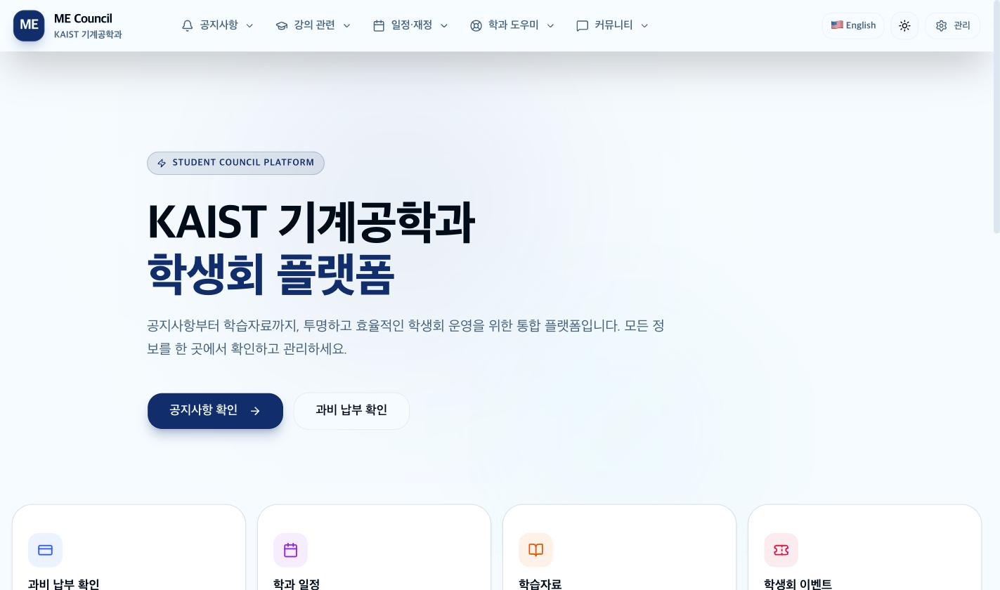
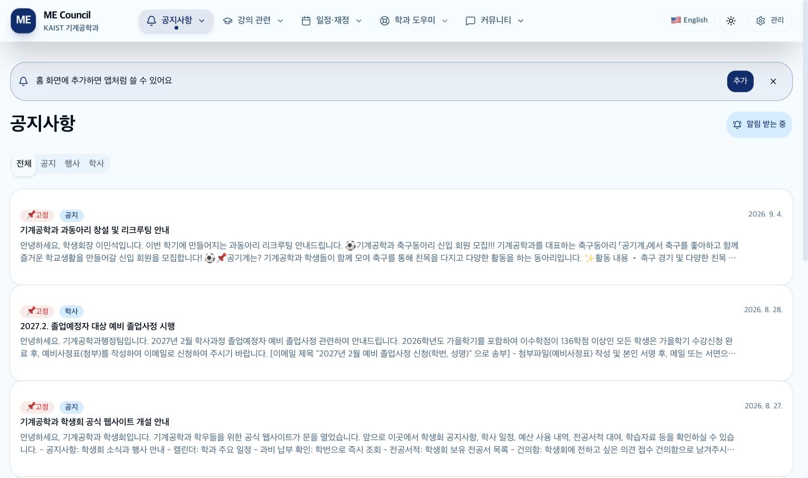
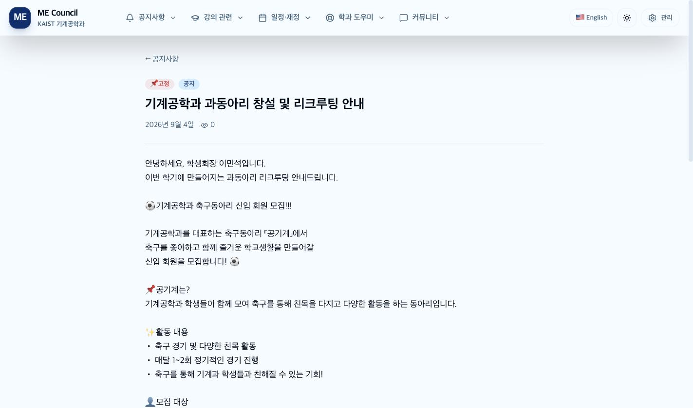
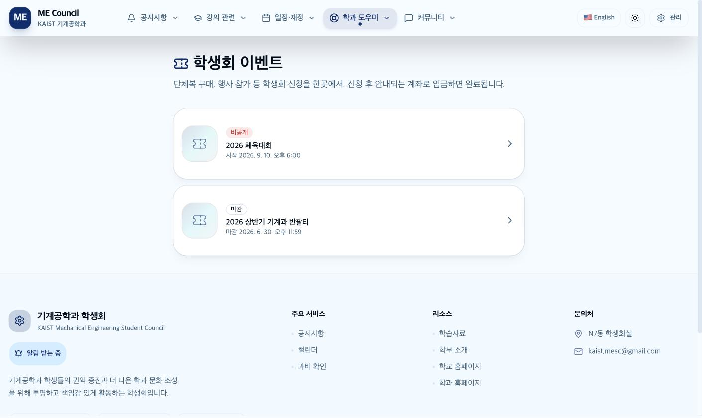
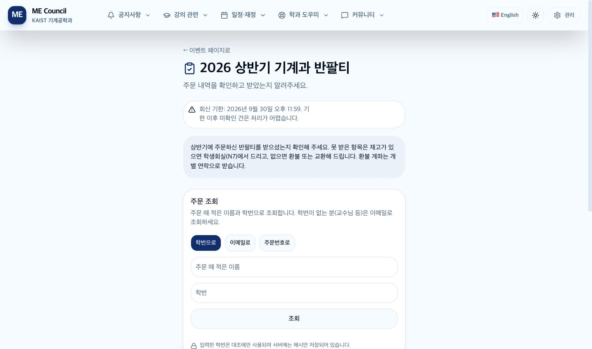
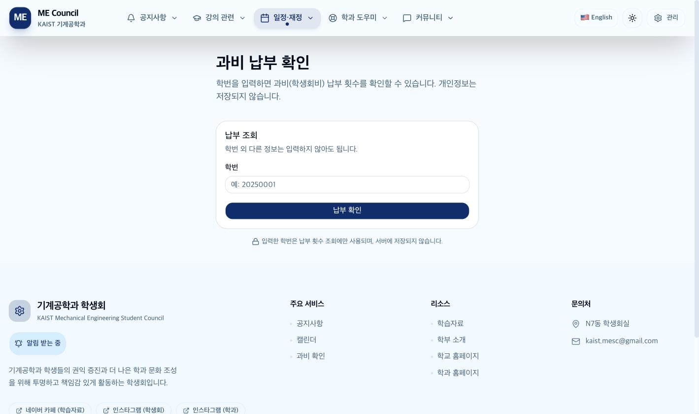
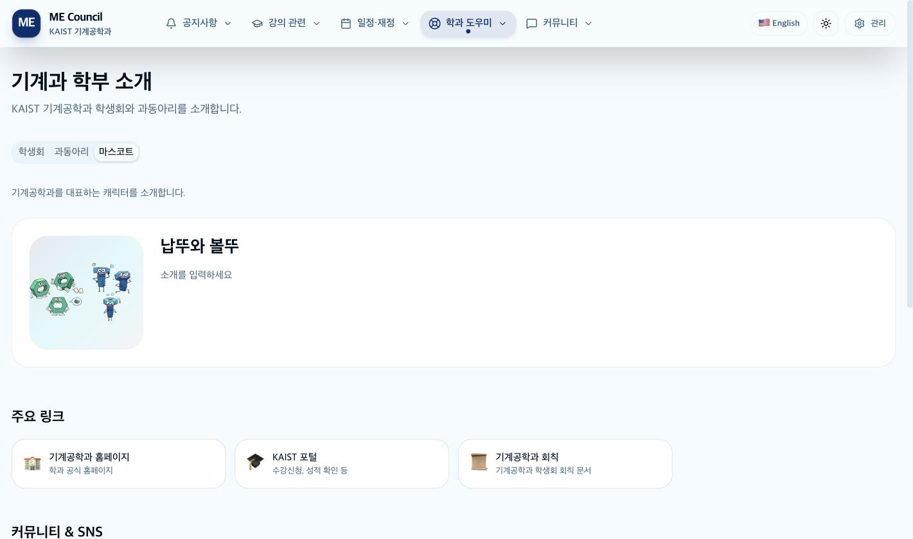

# 기계공학과 학생회 사이트 사용 설명서 (학생용)

**https://mesc-website.vercel.app**

로그인이 필요 없습니다. 휴대폰으로 열어도 컴퓨터와 똑같이 쓸 수 있습니다.

---

## 이 문서를 읽는 법

처음이라면 **1장 → 2장 → 3장**만 읽어도 충분합니다. 나머지는 필요할 때 찾아 보세요.

문제가 생겼다면 **[부록 B — 오류 문구 사전](부록B-오류-문구-사전.md)** 에서 화면에 뜬 문구를 그대로 검색하는 것이 가장 빠릅니다.

### 하고 싶은 일로 찾기

| 하고 싶은 것 | 어디로 | 이 문서 |
|---|---|---|
| 학생회 공지 보기 | 공지사항 → 전체 | [2장](#2장-공지사항) |
| 새 공지를 휴대폰 알림으로 받기 | 공지사항 페이지 오른쪽 위 | [3장](#3장-공지-알림-받기) |
| 사이트를 앱처럼 쓰기 | 브라우저의 홈 화면에 추가 | [3-2](#3-2-아이폰-아이패드) |
| 단체복·행사 신청하기 | 학과 도우미 → 학생회 이벤트 | [4장](#4장-학생회-이벤트-신청과-구매) |
| 내가 신청한 것 확인·취소 | 학생회 이벤트 → 이벤트 → 내 신청 확인 | [4-5](#4-5-내-신청-확인하기) |
| 옷 받았는지 답하기 | 학생회 이벤트 → 이벤트 → 수령 확인 | [4-6](#4-6-수령-확인-받았는지-알려주기) |
| 과비 냈는지 확인 | 일정·재정 → 과비 확인 | [5장](#5장-과비-납부-확인) |
| 학과 일정을 내 캘린더에 넣기 | 일정·재정 → 캘린더 | [6장](#6장-학과-일정-캘린더) |
| 강의자료·족보 찾기 | 강의 관련 → 학습자료 | [7-1](#7-1-학습자료) |
| 과목 정보와 강의평 보기 | 강의 관련 → 수업 정보 | [7-2](#7-2-수업-정보와-강의평) |
| 전공서적 빌릴 수 있는지 보기 | 강의 관련 → 전공서적 | [7-3](#7-3-전공서적) |
| 교수님 연구실 찾기 | 학과 도우미 → 학과 안내 | [8장](#8장-학과-안내-연구실-찾기) |
| 학생회가 누구인지 보기 | 학과 도우미 → 학부 소개 | [9장](#9장-학부-소개) |
| 학생회에 하고 싶은 말 | 커뮤니티 → 건의함 | [10-2](#10-2-건의함) |
| 익명으로 이야기 나누기 | 커뮤니티 → 자유게시판 | [10-3](#10-3-자유게시판) |
| 먹고 싶은 간식 신청 | 커뮤니티 → 간식 위시리스트 | [10-4](#10-4-간식-위시리스트) |
| 행사 사진 보기 | 커뮤니티 → 갤러리 | [10-1](#10-1-갤러리-행사-사진) |

---

## 1장. 사이트 둘러보기

### 1-1. 메뉴 구조

맨 위 메뉴는 다섯 묶음입니다. 컴퓨터에서는 메뉴에 마우스를 올리면 펼쳐지고, 휴대폰에서는 오른쪽 위 버튼을 누르면 펼쳐집니다.

| 메뉴 | 안에 있는 것 |
|---|---|
| **공지사항** | 전체 / 공지 / 행사 / 학사 |
| **강의 관련** | 학습자료 / 전공서적 / 수업 정보 |
| **일정·재정** | 캘린더 / 과비 확인 |
| **학과 도우미** | 학부 소개 / 학과 안내 / 학생회 이벤트 |
| **커뮤니티** | 갤러리 / 건의함 / 자유게시판 / 간식 위시리스트 |

**홈으로 가려면 왼쪽 위 로고를 누르세요.** 메뉴에는 "홈" 항목이 따로 없습니다.

### 1-2. 오른쪽 위 버튼들

- **🇰🇷 / 🇺🇸** — 한국어와 영어를 바꿉니다. 선택은 브라우저에 저장돼 다음에도 유지됩니다.
- **해/달 모양** — 밝은 화면과 어두운 화면을 바꿉니다.
- **관리** — 학생회 임원용 로그인 화면입니다. 학생은 쓸 일이 없습니다.

> 일부 화면(자유게시판 글 상세 등)은 아직 영어 번역이 없어 한국어로 나옵니다.

### 1-3. 홈 화면에 있는 것

- **최신 공지 5건** — 고정된 공지가 먼저 오고, 그다음 최신순입니다. 고정 공지가 많으면 방금 올라온 공지가 5건 안에 안 들어올 수 있으니, 전부 보려면 "공지사항 더보기"를 누르세요.
- **바로가기 카드 4개** — 과비 확인, 학과 일정, 학습자료, 학생회 이벤트
- **팝업** — 중요한 안내가 있으면 들어온 지 잠깐 뒤에 팝업이 뜹니다. **"오늘 그만 보기"를 누르면 24시간 동안 안 뜹니다.** 그사이 팝업 내용이 바뀌어도 안 보이니, 놓친 것 같으면 공지사항을 확인하세요.

### 1-4. 맨 아래(푸터)에 있는 것

학생회실 위치, 이메일, SNS 링크, 그리고 **개인정보처리방침**과 **이용약관** 링크가 있습니다.

---

## 2장. 공지사항

### 2-1. 목록 보기

- 위쪽 탭으로 **전체 / 공지 / 행사 / 학사** 를 나눠 볼 수 있습니다.
- 📌 표시가 붙은 공지는 **항상 맨 위**에 있습니다. 중요한 안내입니다.
- 제목을 누르면 전체 내용이 열립니다.

> 탭을 바꾸는 것은 이미 받아 온 목록을 걸러 보여 주는 것입니다. 페이지를 열어 둔 채로 오래 있었다면 새로고침해야 새 공지가 보입니다.

### 2-2. 상세 화면과 첨부파일

첨부파일이 있으면 본문 아래에 **파일 이름과 크기**가 나옵니다. 누르면 바로 내려받아집니다.

- 구글 드라이브 같은 **다른 사이트로 넘어가지 않습니다.** 로그인도 필요 없습니다.
- 한글 파일 이름도 그대로 유지됩니다.
- 파일이 열리지 않고 오류 화면이 뜨면, 학생회가 공지를 수정하면서 첨부를 바꿨을 수 있습니다. 목록으로 돌아가 다시 들어와 보세요.

### 2-3. 조회수

공지를 열면 조회수가 자동으로 올라갑니다. 같은 사람이 하루에 여러 번 봐도 한 번만 셉니다. 누가 봤는지는 기록하지 않습니다.

---

## 3장. 공지 알림 받기 ⭐

새 공지가 올라오면 휴대폰으로 알림을 받을 수 있습니다. **학생회가 중요하다고 표시한 공지에만** 알림이 갑니다. 모든 공지마다 울리지 않습니다.

### 3-1. 안드로이드·컴퓨터

1. 공지사항 페이지로 갑니다.
2. 오른쪽 위 **"공지 알림 받기"** 를 누릅니다.
3. 브라우저가 물어보면 **허용**을 누릅니다.

끝입니다. 버튼이 "알림 받는 중"으로 바뀝니다.

### 3-2. 아이폰·아이패드

**아이폰은 홈 화면에 추가한 다음에만 알림을 받을 수 있습니다.** 사파리 탭으로 열어 둔 상태에서는 알림 기능 자체가 제공되지 않습니다. 애플 정책이라 우회할 방법이 없습니다.

1. **사파리**로 사이트를 엽니다. (크롬 앱이 아니라 사파리여야 합니다)
2. 화면 아래쪽 **공유 버튼**(위쪽 화살표가 든 네모)을 누릅니다.
3. 목록을 내려 **"홈 화면에 추가"** 를 누릅니다.
4. 홈 화면에 생긴 **아이콘으로 사이트를 다시 엽니다.**
5. 공지사항 페이지에서 **"공지 알림 받기"** 를 누르고 허용합니다.

아이폰에서 조건이 안 맞으면 사이트가 버튼 대신 위 설치 안내를 자동으로 보여 줍니다.

### 3-3. 끄기

같은 버튼을 다시 누르면 꺼집니다.

### 3-4. 알림이 안 올 때

| 증상 | 원인과 해결 |
|---|---|
| 버튼이 계속 "처리 중..." | 네트워크가 느립니다. 잠시 뒤 "응답이 오지 않아 중단했습니다" 가 뜨면 다시 누르세요 |
| "알림이 차단되어 있습니다" | 예전에 "차단"을 누른 상태입니다. **사이트에서는 되돌릴 수 없습니다.** 브라우저 설정 → 사이트 권한 → 알림에서 이 사이트를 허용으로 바꿔야 합니다 |
| 켜져 있는데 안 옴 (아이폰) | 사파리 탭에서 켠 것일 수 있습니다. 홈 화면 아이콘으로 연 뒤 다시 켜 주세요 |
| 켜져 있는데 안 옴 (공통) | 그 공지에 학생회가 알림을 보내지 않았을 수 있습니다. 모든 공지에 알림이 가지는 않습니다 |
| "브라우저에는 등록됐지만 서버 등록이 끝나지 않았습니다" | 화면에 나오는 **"알림 등록 다시 시도"** 를 누르세요 |
| 한동안 잘 오다가 끊김 | 오래 반응이 없으면 구독이 자동 정리됩니다. 다시 켜면 됩니다 |

### 3-5. 앱처럼 쓰기

홈 화면에 추가하면 알림뿐 아니라 **주소창 없는 앱처럼** 쓸 수 있습니다. 안드로이드와 컴퓨터에서는 "홈 화면에 추가하면 앱처럼 쓸 수 있어요" 안내가 뜨면 **추가**를 누르면 됩니다.

---

## 4장. 학생회 이벤트 (신청과 구매)

단체복 구매, 행사 신청 등을 여기서 합니다. 구글폼 대신 쓰는 화면입니다.

**메뉴에서 학과 도우미 → 학생회 이벤트**

### 4-1. 목록 화면

카드마다 상태가 표시됩니다.

| 표시 | 뜻 |
|---|---|
| 신청 중 | 지금 신청할 수 있습니다 |
| 오픈 예정 | 아직 시작 전입니다 |
| 마감 | 신청 기간이 끝났습니다 |
| 수령 확인 진행 중 | 물건을 받았는지 답해 주는 기간입니다 |

### 4-2. 신청하기

1. **이벤트를 고릅니다.**
2. **단체복 같은 상품이면** 사진을 확인합니다. 시안과 사이즈표가 여러 장 올라와 있으니 썸네일을 눌러 넘겨 보세요. 사진을 누르면 원본을 새 탭에서 크게 볼 수 있습니다.
3. **색상 → 사이즈 → 수량**을 고르고 담습니다. **품절인 사이즈는 "품절"로 표시되고 선택되지 않습니다.**
4. 신청자 정보를 적습니다.

| 칸 | 필수 | 알아둘 것 |
|---|---|---|
| 구분 | 필수 | 학부생 / 대학원생 / 교수님 / 졸업생 / 기타. **구분에 따라 금액이 달라질 수 있습니다** |
| 이름 | 필수 | 나중에 조회할 때 **이 이름과 정확히 같아야** 찾을 수 있습니다 |
| 학번 | 이벤트에 따라 다름 | 숫자만 적습니다 |
| 이메일 | 필수 | 연락과 조회에 씁니다 |
| 전화번호 | 선택 | 학생회만 봅니다. 공개 화면에 나가지 않습니다 |
| 입금자명 | 선택 | **비워 두면 이름과 같은 것으로 봅니다.** 가족 이름으로 이체하는 등 다를 때만 적으세요 |
| 전달할 말 | 선택 | 500자까지 |

5. 금액을 확인하고 **신청**을 누릅니다.

### 4-3. 신청이 끝나면 — 꼭 확인하세요

완료 화면에 네 가지가 나옵니다.

1. **주문번호** (예: `TSHI-7K2M9Q`) — 복사 버튼이 있습니다
2. **금액**
3. **입금 계좌**
4. **관리 코드** (8자리)

> ⚠️ **관리 코드는 이때 딱 한 번만 보여 줍니다.**
> 서버에도 되돌릴 수 없는 형태로만 저장되어 있어서, **학생회도 다시 알려 드릴 수 없습니다.**
> 나중에 스스로 취소하려면 이 코드가 필요합니다. **화면을 캡처해 두세요.**
> 잃어버렸다면 학생회에 문의하면 본인 확인 후 대신 취소해 드립니다.

**입금할 때는 신청서에 적은 이름(또는 입금자명 칸에 적은 이름)으로 보내 주세요.** 이름이 다르면 입금 확인이 늦어집니다.

### 4-4. 신청이 안 될 때

| 화면에 나오는 말 | 뜻과 해결 |
|---|---|
| 신청 기간이 아닙니다 | 시작 전이거나 마감. 학생회에 문의 |
| 품절 / 남은 수량이 부족합니다 | 그 사이 다른 사람이 먼저 가져갔습니다. 수량을 줄이거나 다른 옵션으로 |
| 1인당 최대 N개까지 신청할 수 있습니다 | **이전에 신청한 것까지 합산**합니다. 이전 신청을 취소하거나 수량을 줄이세요 |
| 동시에 신청이 몰렸습니다 | 그대로 다시 눌러도 됩니다. 중복 주문은 생기지 않습니다 |
| 미리보기에서는 신청할 수 없습니다 | 아직 공개 전인 이벤트입니다. 학생회만 볼 수 있는 상태입니다 |
| 이미 접수됐을 수 있습니다. 「내 신청 확인」으로 조회한 뒤... | 통신이 끊겼습니다. **먼저 조회부터 하세요.** 없을 때만 다시 신청 |

### 4-5. 내 신청 확인하기

이벤트 화면 아래쪽 **"내 신청 확인"** 을 펼치면 됩니다. 세 가지 중 편한 방법을 쓰세요.

| 방법 | 필요한 것 |
|---|---|
| 이름 + 학번 | 신청할 때 적은 이름과 학번 |
| 이름 + 이메일 | 신청할 때 적은 이름과 이메일 |
| 주문번호 | 주문번호만 |

**이름은 띄어쓰기와 대소문자만 무시하고, 글자는 정확히 일치해야 합니다.** 조회가 안 되면 주문번호로 찾아 보세요.

#### 상태 읽는 법

**대기 → 입금 확인 → 수령 완료**

| 상태 | 뜻 |
|---|---|
| 대기 | 신청됨. 아직 입금 확인 전 |
| 입금 확인 | 학생회가 입금을 확인함 |
| 수령 완료 | 물건을 받아 감 |
| 취소 | 취소됨 |

#### 스스로 취소하기

- **입금 확인 전(대기 상태)에만** 가능합니다.
- **주문번호 + 관리 코드**가 모두 필요합니다.
- 입금 확인된 뒤에는 취소 버튼이 사라집니다. 학생회(kaist.mesc@gmail.com)에 문의하세요.

> 학생회가 예전 명단을 옮겨 넣은 주문은 관리 코드가 없어 **스스로 취소할 수 없습니다.** 학생회에 문의해 주세요.

### 4-6. 수령 확인 (받았는지 알려주기)

이미 배부가 끝난 건에 대해 **받았는지 답해 주는 화면**이 따로 열립니다.

1. 이름과 학번(또는 이메일, 주문번호)으로 조회합니다.
2. 내 주문 내역을 확인합니다.
3. **"받았어요"** 또는 **"못 받았어요"** 를 누릅니다.
4. 못 받았다면 항목마다 어떻게 할지 고릅니다.
   - **학생회실(N7동 2105호)에서 수령** — 나중에 찾아가겠습니다
   - **환불 희망** — 돈으로 돌려받겠습니다
   - **다른 사이즈로 교환** — 같은 색상의 다른 사이즈를 고릅니다
5. 남길 말이 있으면 적고 **답변 제출**을 누릅니다.

한 번 낸 답도 다시 조회해서 **수정**할 수 있습니다.

> **주문번호만으로 조회하면 답변을 낼 수 없습니다.** 본인 확인을 위해 이름과 학번(또는 이메일)으로 다시 조회해야 합니다.
>
> **환불 계좌는 이 화면에서 받지 않습니다.** 학생회가 개별로 연락드립니다.
>
> 취소한 신청은 이 화면에 나오지 않습니다.

---

## 5장. 과비 납부 확인

**일정·재정 → 과비 확인**

학번을 넣고 **납부 확인**을 누르면 끝입니다.

### 결과 읽는 법

| 결과 | 뜻 |
|---|---|
| 납부 횟수: 2회 이상 + 초록색 | 과비가 모두 납부되었습니다 |
| 노란색 | 일부만 납부되었습니다. 학생회에 문의하세요 |
| 빨간색 | 미납 상태입니다 |
| 납부 내역 없음 | 명단에서 학번을 찾지 못했습니다 |

### 알아둘 것

- **입력한 학번은 저장되지 않습니다.** 주소창에도 남지 않습니다.
- **학번은 숫자만** 넣으세요. 하이픈이나 공백이 섞이면 "납부 내역 없음"이 나올 수 있습니다.
- 1분에 5번까지만 조회할 수 있습니다.
- 결과는 학생회가 관리하는 명단을 그대로 읽은 것입니다. 실제로 냈는데 안 나온다면 학생회에 문의하세요. (이용약관에도 조회 결과는 참고용이라고 적혀 있습니다)

---

## 6장. 학과 일정 (캘린더)

**일정·재정 → 캘린더**

### 볼 수 있는 것

- 월별 달력. 위쪽 화살표로 달을 옮기고, "2026년 9월"을 누르면 연·월을 바로 고를 수 있습니다.
- **다가오는 일정** — 오늘 이후 가까운 순으로 최대 5개

### 내 캘린더에 넣기

| 버튼 | 대상 |
|---|---|
| Google Calendar 구독 | 구글 캘린더 쓰는 사람 |
| iCal 구독 링크 복사 (Apple) | 아이폰·맥 캘린더 쓰는 사람. 복사한 링크를 캘린더 앱의 "구독" 에 붙여넣습니다 |

한 번 구독해 두면 학생회가 일정을 추가할 때 **자동으로 따라옵니다.**

> 구독 버튼이 회색이면 학생회가 아직 구독 주소를 설정하지 않은 것입니다.
> 여러 날에 걸친 일정은 각 달에 모두 표시됩니다.

---

## 7장. 강의 관련

### 7-1. 학습자료

**강의 관련 → 학습자료**

- 위쪽 탭으로 **200 / 300 / 400 / 기타** 수준별로 걸러 볼 수 있습니다.
- 카드를 누르면 자료가 새 탭에서 열립니다.
- **"카페" 표시**가 붙은 자료는 네이버 카페로 이동합니다. 카페 가입이 필요할 수 있습니다.

> 탭 선택은 주소에 남지 않아서, 새로고침하면 "전체"로 돌아갑니다.

### 7-2. 수업 정보와 강의평

**강의 관련 → 수업 정보**

과목을 고르면 전공서적, 참고 영상, 족보·자료, 그리고 **강의평**을 볼 수 있습니다.

#### 강의평 쓰기

익명입니다. 이름을 적지 않습니다.

| 칸 | 규칙 |
|---|---|
| 별점 | 1~5, 필수 |
| 닉네임 | 1~20자, 필수 |
| 비밀번호 | 4~100자, 필수 |
| 내용 | 5~1000자, 필수 |

1분에 5개까지 쓸 수 있습니다.

> ⚠️ **비밀번호를 꼭 기억하세요.** 나중에 내 강의평을 고치거나 지울 때 필요하고, **잃어버리면 되찾을 방법이 없습니다.**
>
> 삭제 창에 "관리자는 빈칸" 이라고 쓰여 있지만 그건 학생회용 안내입니다. 학생은 반드시 비밀번호를 넣어야 합니다.

부적절한 내용은 신고 버튼으로 알려 주세요.

### 7-3. 전공서적

**강의 관련 → 전공서적**

학생회가 보유한 전공서적 목록입니다. 카테고리 탭으로 걸러 볼 수 있고, 과목과 연결된 책은 눌러서 과목 화면으로 갈 수 있습니다.

**보유 권수**가 표시됩니다. 지금 빌릴 수 있는지는 화면에 나오지 않으니, 학생회실에 문의하세요.

---

## 8장. 학과 안내 (연구실 찾기)

**학과 도우미 → 학과 안내**

탭이 두 개입니다.

### 건물 지도

1. 건물을 고릅니다.
2. 층을 고릅니다.
3. 평면도에서 **교수님 이름이나 호실을 검색**하면 해당 위치로 자동으로 이동합니다. 다른 층에 있으면 층까지 알아서 바뀝니다.
4. 평면도의 핀을 누르면 아래에 상세 정보가 뜹니다.
5. 휠이나 손가락으로 확대·축소, 드래그로 이동할 수 있습니다.

### 교수님 찾기

이름, 영문 이름, 연구 분야, 호실로 검색할 수 있습니다. 이메일과 웹사이트 링크가 있고, **"지도에서 보기"** 를 누르면 평면도의 해당 위치로 갑니다.

> **교수님 전화번호는 공개하지 않습니다.** 이메일로 연락하세요.
> 평면도 검색은 **지금 선택한 건물 안에서만** 동작합니다.
> 좌표가 등록되지 않은 연구실은 "지도에서 보기"를 눌러도 층까지만 이동합니다.

---

## 9장. 학부 소개

**학과 도우미 → 학부 소개**

탭이 세 개입니다.

- **학생회** — 부서별 구성원. 회장단이 맨 앞에 옵니다.
- **과동아리** — 동아리 소개와 공식 사이트·인스타그램 링크
- **마스코트** — 학과 마스코트 소개 (등록된 것이 있을 때만 탭이 나타납니다)

아래쪽에 **주요 링크**와 **커뮤니티·SNS** 모음이 있습니다.

---

## 10장. 커뮤니티

**커뮤니티** 메뉴 아래 네 가지가 있고, 한 화면에서 탭으로 넘나듭니다.

### 10-1. 갤러리 (행사 사진)

행사 카드를 누르면 사진과 후기를 볼 수 있습니다.

- 사진을 누르면 크게 볼 수 있습니다.
- **별점과 한마디**를 남길 수 있습니다. 익명이고 500자까지입니다.
- 별점을 안 누르고 제출하면 5점으로 기록됩니다.

### 10-2. 건의함

학생회에 하고 싶은 말을 남기는 곳입니다.

| 칸 | 규칙 |
|---|---|
| 카테고리 | 행사 / 시설 / 학사 / 기타 |
| 건의 내용 | 5~2000자, 필수 |
| 연락처 | 선택. **학생회만 봅니다** |

- **이름을 적지 않아도 됩니다.** 답변이 필요할 때만 연락처를 남기세요.
- 남긴 연락처는 **답변 후 30일 안에 지워집니다.**
- 1분에 2건까지 쓸 수 있습니다.
- 답변이 달리면 목록에서 함께 볼 수 있습니다. 답변 달린 건의가 먼저 나옵니다.

> 본문에 학번이나 전화번호를 적어도 사이트가 막지는 않지만, **연락처 칸에 적는 편이 안전합니다.** 본문은 다른 학생도 볼 수 있습니다.

### 10-3. 자유게시판

익명 게시판입니다.

| 칸 | 규칙 |
|---|---|
| 카테고리 | 자유 / 질문 / 정보공유 |
| 제목 | 2~100자 |
| 내용 | 5~5000자 |

- **이름 칸이 없습니다.** `익명#a1b2` 같은 태그가 자동으로 붙습니다. **이 태그는 글마다 달라집니다** — 같은 사람이라도 다른 글에서는 다른 태그로 보입니다.
- 1분에 3건까지 쓸 수 있습니다.
- **욕설, 학번(8자리 숫자), 전화번호, 이메일이 들어간 글은 등록되지 않습니다.**
- 신고가 5건 쌓이면 자동으로 숨겨집니다.
- 글에 **좋아요**를 누를 수 있고, 댓글을 달 수 있습니다(1~1000자, 1분에 10건).

> ⚠️ **한 번 올린 글과 댓글은 스스로 지울 수 없습니다.** 지워야 할 사유가 있으면 건의함이나 이메일로 학생회에 요청하세요.

### 10-4. 간식 위시리스트

먹고 싶은 간식 이름을 적어 넣는 곳입니다. 100자까지, 10분에 3건까지 쓸 수 있습니다. 한 번 올린 것은 스스로 지울 수 없습니다.

---

## 11장. 내 정보는 어떻게 다뤄지나

### 저장하지 않는 것

- **과비 확인에 넣은 학번** — 조회에만 쓰고 저장하지 않습니다. 주소창에도 남지 않습니다.
- **신청서의 학번 원문** — 대조용 형태로 바꿔서 저장합니다. 학생회 화면에도 학번은 보이지 않습니다.
- **IP 주소 원문** — 알아볼 수 없는 형태로만 저장하고 90일 뒤 지웁니다.
- **주문 관리 코드 원문** — 되돌릴 수 없는 형태로만 저장합니다.

### 저장하고, 정해진 기간 뒤 지우는 것

| 정보 | 언제까지 |
|---|---|
| 건의함에 남긴 연락처 | 답변 후 30일 |
| 신청서의 이름·이메일·전화·입금자명 | 이벤트 마감 후 180일 (그 뒤 지워지고 금액·항목 통계만 남습니다) |
| 알림 구독 정보 | 180일 동안 응답이 없으면 삭제 |

### 그 밖

- 사진을 올리면 **촬영 위치·기기 정보가 자동으로 지워집니다.**
- 전화번호는 공개 화면에 절대 나가지 않습니다.
- 조회수와 좋아요 중복을 막기 위해 브라우저에 방문자 표시를 하나 저장합니다. 누구인지는 알 수 없는 값입니다.

자세한 내용은 사이트 맨 아래 **개인정보처리방침**에 있습니다.

---

## 12장. 자주 묻는 것

**로그인해야 하나요?**
아니요. 학생이 쓰는 기능은 전부 로그인 없이 됩니다. "관리" 메뉴는 학생회 임원용입니다.

**알림을 켰는데 안 와요.**
아이폰이라면 홈 화면에 추가한 아이콘으로 열어서 켰는지 확인하세요. 사파리 탭에서 켠 것은 동작하지 않습니다. 그리고 모든 공지에 알림이 가지는 않습니다. 자세한 것은 [3-4](#3-4-알림이-안-올-때) 를 보세요.

**관리 코드를 잃어버렸어요.**
학생회에 문의해 주세요. 본인 확인 후 대신 처리해 드립니다. 서버에도 원문이 없어서 다시 알려 드릴 수는 없습니다.

**신청 내역이 조회가 안 돼요.**
신청할 때 적은 이름과 글자가 정확히 같아야 합니다(띄어쓰기는 무시됩니다). 주문번호로 조회해 보세요.

**신청 버튼을 눌렀는데 화면이 멈췄어요. 다시 눌러야 하나요?**
**먼저 "내 신청 확인"으로 조회해 보세요.** 이미 접수됐을 수 있습니다. 없을 때만 다시 신청하세요.

**이미 입금했는데 아직 "대기"예요.**
학생회가 통장을 확인하고 손으로 바꿉니다. 하루 이틀 걸릴 수 있습니다. 입금자명이 신청서 이름과 다르면 더 걸리니, 다르다면 학생회에 알려 주세요.

**자유게시판에 잘못 올렸어요. 지울 수 있나요?**
스스로 지울 수는 없습니다. 건의함이나 이메일로 학생회에 요청해 주세요.

**영어로 봤는데 일부가 한국어예요.**
아직 번역되지 않은 화면이 있습니다. 불편한 곳을 건의함으로 알려 주시면 반영하겠습니다.

**과비를 냈는데 미납으로 나와요.**
명단 반영이 늦었을 수 있습니다. 학생회에 문의해 주세요.

---

## 문의

- **이메일**: kaist.mesc@gmail.com
- **학생회실**: N7동 2105호
- **건의함**: 커뮤니티 → 건의함 (익명 가능)

---

### 함께 보기

- [부록 A — 규칙과 한도](부록A-규칙과-한도.md) — 파일 크기, 보유 기간, 상태 규칙 등 정확한 값
- [부록 B — 오류 문구 사전](부록B-오류-문구-사전.md) — 화면에 뜬 문구로 원인 찾기
